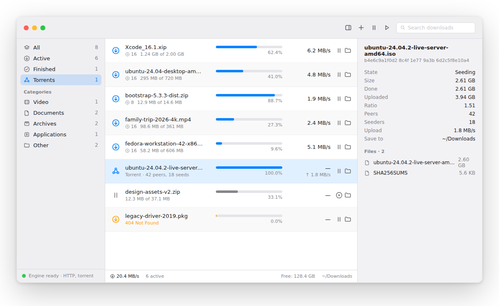

<div align="center">


# McDownloader

**Fast downloads and torrents for macOS, in one clean little app.**

Multi-connection HTTP downloads and BitTorrent, living quietly in your menu bar.

[](https://github.com/zakiyys/McDownloader/releases/latest)


[](LICENSE)



</div>

---

## Why McDownloader?

Safari and Chrome download one file over one connection. If it drops, you start over.
McDownloader splits each file into several connections, resumes where it left off
(even after a restart), and handles torrents too, so you never need two apps again.

## Features

### ⚡ Faster downloads
- **Multi-connection downloads** that pull a file in parallel pieces
- **Pause and resume anytime**, even after quitting the app or restarting your Mac
- **Download queue** with speed limits, so your Zoom call stays smooth

### 🧲 Built-in torrents
- Open **magnet links** and **.torrent files** with a click
- **Choose which files** to download inside a torrent
- **Seeding limits** by ratio or time, so you share fairly without thinking about it
- Fast peer discovery out of the box (DHT, UPnP, extra public trackers)

### 🌐 Browser extension
- One click sends downloads from **Chrome, Edge, or Brave** to McDownloader
- Works with login-protected and expiring links, since your cookies come along
- Talks only to the app on your own Mac. Nothing leaves your machine

### 🎬 Video grabbing
- Save videos from supported sites (powered by yt-dlp, set up automatically the first time you use it)

### 🍎 Feels like a Mac app
- Lives in the **menu bar**, out of your way
- **Native notifications** when downloads finish
- **Keeps your Mac awake** while transferring, and can **put it to sleep** when the queue is done
- Downloaded apps and disk images still get **checked by Gatekeeper**, just like Safari downloads

## Install

1. Download the latest **`.dmg`** from [Releases](https://github.com/zakiyys/McDownloader/releases/latest).
2. Drag **McDownloader** into your Applications folder.
3. On first launch, **Control-click** the app and choose **Open**, then confirm.

> McDownloader isn't notarized by Apple yet (that requires a paid developer account),
> so macOS asks you to confirm once. Prefer the terminal?
> `xattr -dr com.apple.quarantine /Applications/McDownloader.app`

**Updating:** download the newest `.dmg` and replace the app. Click **Watch → Custom → Releases**
on this repo to get notified when a new version is out.

## Set up the browser extension

1. Open `chrome://extensions` and turn on **Developer mode**.
2. Click **Load unpacked** and pick the `Extension` folder from this repo.
3. In McDownloader, open **Settings → Browser** and copy your token.
4. Paste it into the extension's **Options** page. Done.

## Under the hood

Two proven engines, one interface:

- **[aria2](https://aria2.github.io)** for HTTP, HTTPS, and FTP
- **[libtorrent](https://www.libtorrent.org)**, the same engine behind qBittorrent, for BitTorrent

Each engine runs in its own process, so if one hiccups, the app and your other downloads keep going.

<details>
<summary><b>Build from source</b></summary>

Requires macOS 14+ and the Xcode command line tools.

```bash
git clone https://github.com/zakiyys/McDownloader.git
cd McDownloader
swift build -c release --package-path App

# engines (or grab them from a release build)
./scripts/build-aria2-universal.sh "$PWD/vendor"
./scripts/build-libtorrent-universal.sh "$PWD/vendor"

# package the .app
BINARY="$(swift build -c release --package-path App --show-bin-path)/McDownloader"
./scripts/package-app.sh --binary "$BINARY" --out dist \
  --aria2 vendor/aria2c --torrent-helper vendor/mcdownloader-torrentd
```

</details>

## FAQ

**Is this related to Internet Download Manager (IDM)?**
No. McDownloader is an independent, open source app inspired by the same idea. It's not a port, crack, or repack of IDM.

**Is it free?**
Yes, free and open source under GPL-3.0.

**Does it collect any data?**
No. The browser extension only talks to the app on `127.0.0.1`, and there's no analytics.

## License

[GPL-3.0](LICENSE). Built on the shoulders of aria2 and libtorrent.

<div align="center">

Made by [zakiyys](https://github.com/zakiyys) · If it saves you time, a ⭐ helps a lot

</div>
